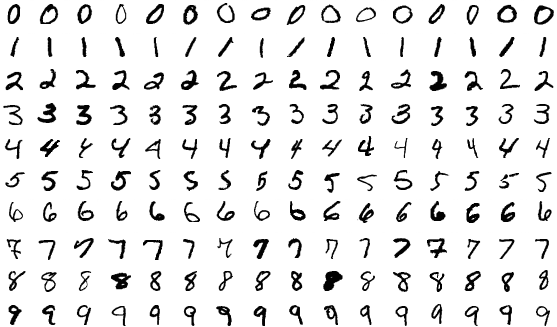
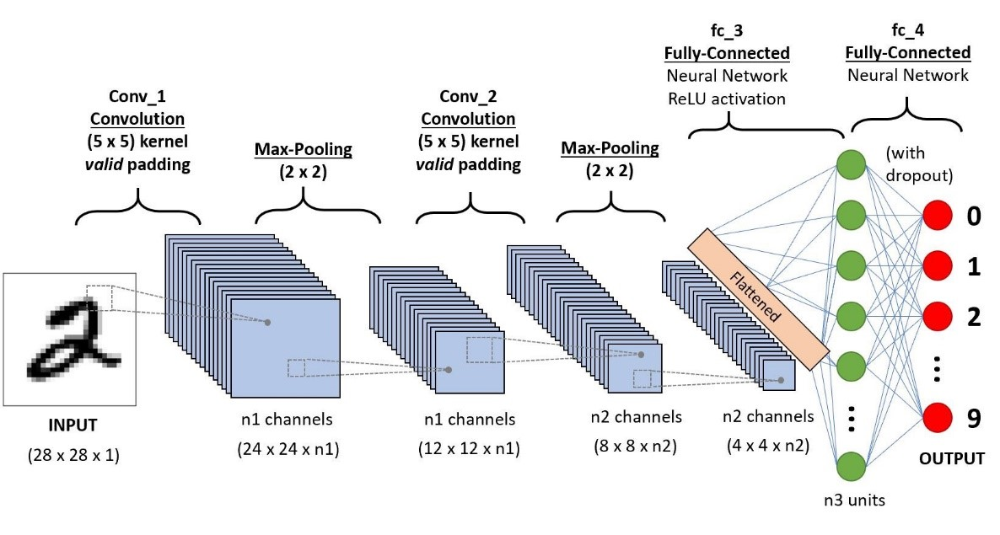
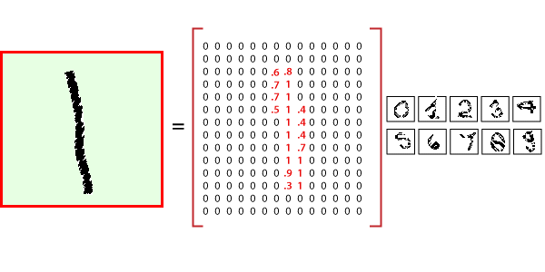
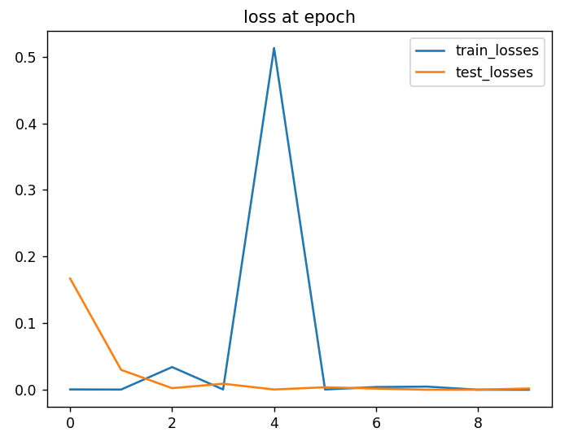
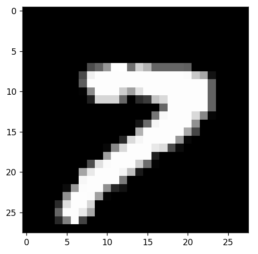

# Deep Learning with PyTorch for MNIST Image Classification

The MNIST database (Modified National Institute of Standards and Technology database) is a large database of handwritten digits that contains 60,000 training images and 10,000 testing images. 



Sample images from MNIST test dataset

 Here, the MNIST database is used for training and testing our Convolutional Neural Network. A convolutional neural network (CNN) is a specialized form of feed-forward neural network that autonomously identifies features through the optimization of filters (or kernels). This deep learning architecture has been utilized to analyze and predict outcomes from various data types, such as text, images, and audio. Its application in geoscience, especially in seismic interpretation is rapidly expanding, reflecting its growing significance in these fields.

A convolutional neural network is made up of an input layer, multiple hidden layers, and an output layer. Within a convolutional neural network, the hidden layers feature one or more layers responsible for performing convolutions. Generally, this involves a layer that computes the dot product between the convolution kernel and the input matrix from the previous layer. This computation typically results in the Frobenius inner product, with the activation function often being ReLU. As the convolution kernel moves across the input matrix, the convolution process produces a feature map that serves as input for the subsequent layer. This is succeeded by additional layers, which may include pooling layers, fully connected layers, and normalization layers.



              Typical CNN architecture
              

Now before we start, it is important to note that every data in MNIST images point has two parts: an image (x) and a corresponding label (y) describing the actual image and each image is a 28x28 array, i.e., 784 numbers. The label of the image is a number between 0 and 9 corresponding to the TensorFlow MNIST image.



          Sample MNIST dataset in TensorFlow
          


```python
import torch
import torch.nn as nn
import torch.nn.functional as F
import pandas as pd
import numpy as np
from torch.utils.data import DataLoader
from torchvision import datasets, transforms
from torchvision.utils import make_grid
from sklearn.metrics import confusion_matrix
import matplotlib
matplotlib.use('TkAgg')
import matplotlib.pyplot as plt
```


```python
#convert MNIST image dataset into a 4D (# of images, height, width, colour channels)
transform = transforms.ToTensor()
train_data = datasets.MNIST(root= '/cnn_data', train= True, download= True, transform=transform)
test_data = datasets.MNIST(root= '/cnn_data', train= False, download= True, transform=transform)
```


```python
# batch size
train_loader = DataLoader(train_data, batch_size=10, shuffle= True)
test_loader = DataLoader(test_data, batch_size=10, shuffle= True)
```


```python
#Model Class
class MYCNN(nn.Module):
    def __init__(self):
        super().__init__()
        self.conv1 = nn.Conv2d(1, 6, 3, 1)
        self.conv2 = nn.Conv2d(6, 16, 3, 1)
        # fully connected NN
        self.fc1 = nn.Linear(5*5*16, 120)
        self.fc2 = nn.Linear(120, 84)
        self.fc3 = nn.Linear(84, 10)

    def forward(self, x):
        x = F.relu(self.conv1(x))
        x = F.max_pool2d(x, 2, 2)
        x = F.relu(self.conv2(x))
        x = F.max_pool2d(x, 2, 2)

        # Review to flattern it out
        x = x.view(-1, 16*5*5) #Negative one so we can vary the batch size

        #Fully connected layer
        x = F.relu(self.fc1(x))
        x = F.relu(self.fc2(x))
        x = self.fc3(x)
        return  F.log_softmax(x, dim=1)

# creat an instance of our model
torch.manual_seed(41)

model = MYCNN()
```

## Training


```python
# set the criterion of model to measure the error
criterion = nn.CrossEntropyLoss()
# choose optimization, lr = learning rate
optimizer = torch.optim.Adam(model.parameters(), lr=0.001)

import time
start_time = time.time()

epochs = 10
train_losses = []
test_losses = []
train_correct = []
test_correct = []

for i in range(epochs):
    trn_corr = 0
    test_corr = 0

    # train
    for b, (x_train, y_train) in enumerate(train_loader):
        b+=1 #start our batches at 1

        # Go forward and get a prediction
        y_pred = model.forward(x_train)

        # Measure the loss
        loss = criterion(y_pred, y_train)

        # add up the number of correct predictions. Indexed of the first point
        predicted = torch.max(y_pred.data, 1)[1]

        #how many we got correct
        batch_corr = (predicted == y_train).sum()

        #keep track along training
        trn_corr += batch_corr

        # back propagation
        optimizer.zero_grad()
        loss.backward()
        optimizer.step()

        # print out some results
        if b % 600 ==0:
            print(f'Epoch: {i} batch: {b} and loss: {loss.item()}')

    train_correct.append(trn_corr)
    train_losses.append(loss)

    #test
    with torch.no_grad():
        for b, (x_test, y_test) in enumerate(test_loader):
            b += 1
            y_val = model(x_test)
            #Adding up correct prediction
            predicted = torch.max(y_val.data, 1)[1]
            test_corr += (predicted == y_test).sum()

    loss = criterion(y_val, y_test)
    test_losses.append(loss)
    test_correct.append(test_corr)


current_time = time.time()
total = current_time - start_time
print(f'Training Took: {total/60} minutes!')

test_load_everything = DataLoader(test_data, batch_size=10000, shuffle=False)

with torch.no_grad():
    correct = 0
    for X_test, y_test in test_load_everything:
        y_val = model(X_test)
        predicted = torch.max(y_val, 1)[1]
        correct += (predicted == y_test).sum()

```

### Training Accuracy


```python
# Calculate accuracy
Accuracy = correct.item() / len(test_data) * 100
```


```python
Accuracy
```


    96.6199999


### Losses Tracjing


```python
train_losses = [tl.item() for tl in train_losses]
plt.plot(train_losses, label= "train_losses")
plt.plot(test_losses, label= "test_losses")
plt.title("loss at epoch")
plt.legend()
plt.show()
```



          Train and test losses after 10 epochs
       

## Prediction

Predict New Image


```python
plt.imshow(test_data[4142][0].view(28, 28).numpy(), cmap='gray')
plt.show()
```



      A new image has been loaded for testing the model


```python
model.eval()
with torch.no_grad():
    new_prediction = model(test_data[4142][0].view(1, 1, 28, 28)) 

new_prediction = new_prediction.argmax()

```


```python
new_prediction
```


    tensor(7.)


The model successfully predicts the number of handwritings
